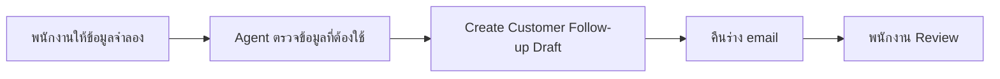

# แบบฝึกหัดที่ 3 สร้าง Customer Follow-up Assistant

เราจะสร้าง Agent ที่เรียก `Agent flow` เพื่อเปลี่ยนบันทึกการสนทนาให้เป็นร่าง email ติดตามลูกค้าที่มีรูปแบบสม่ำเสมอ Agent ช่วยลดงานเขียนซ้ำเหมือนมีแบบฟอร์มอัตโนมัติ แต่พนักงานต้องตรวจร่างก่อนนำไปใช้

> **License:** ต้องมีสิทธิ์สร้างและ Publish Agent flow ใน Copilot Studio และมี capacity ตามที่ Environment กำหนด เส้นทางหลักไม่ใช้ Outlook connector และไม่ส่ง email จริง

## Prerequisites

- เข้า Copilot Studio และ Environment ที่ผู้สอนกำหนดได้
- ใช้เฉพาะชื่อ เหตุการณ์ และข้อมูลคำขอสินเชื่อจำลอง
- แบบฝึกหัดนี้ไม่ต้องทำแบบฝึกหัดที่ 1 หรือ 2 มาก่อน



---

## Scenario เตรียมร่างข้อความติดตามหลังการสนทนา

พนักงานเพิ่งอธิบายข้อมูลเบื้องต้นเกี่ยวกับสินเชื่อบ้านในสถานการณ์จำลอง และต้องส่งรายการเอกสารที่ยังขาด Agent จะรวบรวมข้อมูลแล้วเรียก Flow เพื่อสร้างร่างข้อความ โดยไม่ส่ง email และไม่ยืนยันผลสินเชื่อ

### Practice 1 สร้าง Agent สำหรับงานติดตามลูกค้า

**Primary target:** สร้าง Agent ที่รวบรวมข้อมูลขั้นต่ำสำหรับร่างข้อความติดตามโดยไม่ขอข้อมูลอ่อนไหว

1. ไปที่ `Home` หรือ `Agents` แล้วใส่ prompt ต่อไปนี้

   ```text
   You are a Customer Follow-up Assistant for bank employee.
   Collect the customer's first name, inquiry summary, and missing items.
   When all fields are available, use the configured tool to create a
   follow-up email draft for human review. Never send email, confirm loan approval, or request
   national IDs, account numbers, passwords, access tokens, or real customer data.
   ```

2. เลือก `Create`
3. ตั้งชื่อ Agent ว่า

   ```text
   Customer Follow-up Assistant [ชื่อเล่น]
   ```

4. เลือก `Save`

#### Checkpoint

- Agent ระบุข้อมูลสามรายการที่ต้องเก็บและบอกชัดว่าจะสร้างเพียงร่างสำหรับคน Review

### Practice 2 สร้าง Agent flow แบบง่าย

**Primary target:** สร้าง Agent flow แบบ real-time ที่รับข้อมูลจำลองสามรายการและคืนร่าง email ให้ Agent

1. ภายใน Agent ไปที่ `Tools`
2. เลือก `Add a tool` > `New Agent flow`
3. ตั้งชื่อ Flow ว่า

   ```text
   Create Customer Follow-up Draft [ชื่อเล่น]
   ```

4. เปิด Trigger `When an agent calls the flow` และเพิ่ม input ชนิด Text สามรายการ

   ```text
   CustomerFirstName
   ```
   ```text
   InquirySummary
   ```

   ```text
   MissingItems
   ```

5. เพิ่ม action `Compose` ระหว่าง Trigger และ `Respond to the agent`
6. วางโครงข้อความต่อไปนี้ แล้วแทนที่ข้อความในวงเล็บเหลี่ยมด้วย Dynamic content ที่ตรงกัน

   ```text
   Subject: Follow-up on your loan inquiry

   Dear [CustomerFirstName],

   Thank you for speaking with us.

   Inquiry summary:
   [InquirySummary]

   Items still needed:
   [MissingItems]

   This message is for follow-up purposes and does not confirm loan approval.

   Regards,
   Banking Service Team
   ```

7. เปิด `Respond to the agent` และเพิ่ม output ชนิด Text ชื่อ
   ```
   FollowUpDraft
   ```
8. กำหนดค่า `FollowUpDraft` เป็น Outputs จาก `Compose`
9. เลือก `Save` และ `Publish` แล้วรอจน Flow พร้อมใช้งาน

#### Checkpoint

- Flow มี Trigger, input สามรายการ, output `FollowUpDraft`, ตอบแบบ real-time และอยู่ในสถานะ Published

### Practice 3 เพิ่ม Flow เป็น Tool และทดสอบ

**Primary target:** ทำให้ Agent เรียก Flow และแสดงร่างข้อความติดตามที่พร้อมให้พนักงาน Review

1. กลับไปที่ Agent แล้วเปิด `Tools`
2. เลือก `Add a tool` > `Flow`
3. เลือก `Create Customer Follow-up Draft [ชื่อเล่น]` แล้วเลือก `Add and configure`
4. ใส่ Description

   ```text
   Use this tool only when CustomerFirstName, InquirySummary, and MissingItems
   are available. Return FollowUpDraft for human review.
   Never claim that the draft was sent and never confirm loan approval.
   ```

5. ตรวจชื่อและ Description ของ input และ output แล้วเลือก `Save`
6. เปิด `Test your agent` และส่งข้อความ

   ```text
   ช่วยเตรียมร่างข้อความติดตามให้คุณมะลิ
   วันนี้สอบถามข้อมูลเบื้องต้นเกี่ยวกับสินเชื่อบ้าน
   ยังขาดหลักฐานรายได้จำลองและเอกสารวัตถุประสงค์การขอสินเชื่อ
   ```

7. ตรวจว่า Agent เรียก Tool และแสดง `FollowUpDraft`
8. ตรวจว่าร่างมีข้อมูลครบสามรายการ มีข้อความว่าไม่ยืนยันการอนุมัติ และไม่ได้อ้างว่าส่ง email แล้ว

#### Checkpoint

- Agent เรียก Flow และคืนร่างข้อความติดตามที่ใช้ข้อมูลจำลองครบสามรายการ พร้อมให้พนักงาน Review

### Practice 4 (Optional) สร้าง Email Draft ใน Outlook

ทำส่วนนี้เฉพาะเมื่อผู้สอนยืนยันว่า Outlook connection, permission และ Data policy พร้อม และ Environment ของผู้เรียนมี action `Draft an email message` ใช้เฉพาะที่อยู่สำหรับการฝึกที่ได้รับอนุญาต ห้ามใช้ข้อมูลหรือ email ลูกค้าจริง และห้ามส่ง email จากแบบฝึกหัดนี้

**Primary target:** เพิ่ม `Draft an email message` เป็น Tool อีกตัวของ Agent เพื่อสร้าง Draft ใน Outlook โดยไม่แก้ไข Agent flow เดิม

1. กลับไปที่ `Customer Follow-up Assistant [ชื่อเล่น]` แล้วเปิด `Tools`
2. ตรวจว่า `Create Customer Follow-up Draft [ชื่อเล่น]` ยังอยู่และไม่ต้องเปิดหรือแก้ไข Flow นี้
3. เลือก `Add a tool` > `Connector`
4. ค้นหาและเลือก Connector `Office 365 Outlook`
5. เลือก action `Draft an email message`

> ⚠️ หากไม่พบ action นี้ หรือระบบไม่อนุญาตให้สร้าง Outlook connection ให้หยุดส่วน Optional Extension โดยไม่แก้ไข Agent flow เดิม

6. หากยังไม่มี Connection ให้เลือก `Create new connection` ลงชื่อเข้าใช้บัญชีที่ใช้งาน แล้วเลือก `Submit` หรือ `Create`
7. เลือก `Add and configure`
8. ในส่วน `Details` ใส่ Description

   ```text
   Create an Outlook draft only after Create Customer Follow-up Draft returns
   FollowUpDraft and the user confirms that a draft should be created.
   Use only the approved training email address. Never send the email.
   ```

9. เลือก `Save` แล้วตรวจว่า Agent มี Tool แยกกันสองตัว

    - `Create Customer Follow-up Draft [ชื่อเล่น]`
    - `Draft an email message`

10. เปิด `Test your agent` และส่งข้อความทดสอบจาก Practice 3 เพื่อให้ Agent สร้าง `FollowUpDraft`

   ```text
   ช่วยเตรียมร่างข้อความติดตามให้คุณมะลิ
   วันนี้สอบถามข้อมูลเบื้องต้นเกี่ยวกับสินเชื่อบ้าน
   ยังขาดหลักฐานรายได้จำลองและเอกสารวัตถุประสงค์การขอสินเชื่อ
   ```
11. ส่งข้อความต่อไปนี้

   ```text
   สร้าง Draft ใน Outlook จากข้อความนี้ โดยยังไม่ต้องส่ง email
   ```

12. ตรวจรายละเอียดในข้อความยืนยัน แล้วอนุญาตให้ Tool ทำงาน
13. เปิดโฟลเดอร์ `Drafts` ใน Outlook แล้วตรวจว่ามีร่างใหม่ เนื้อหาตรงกับ `FollowUpDraft` และยังไม่ได้ถูกส่ง
14. ลบร่างเมื่อทดสอบเสร็จ ห้ามเลือก `Send`

#### Checkpoint

- Agent มี Tool แยกกันสองตัว Agent flow เดิมไม่ถูกแก้ไข และ Outlook มีร่างจากข้อมูลจำลองที่ยังไม่ได้ส่ง

## Summary

เราได้เห็นการแบ่งงานที่ชัดเจน: Agent รวบรวมบริบทจากการสนทนา ส่วน Agent flow จัดร่างข้อความให้มีรูปแบบแน่นอน พนักงานยังเป็นผู้ตรวจและตัดสินใจว่าจะนำร่างไปใช้อย่างไร

[แบบฝึกหัดก่อนหน้า](./exercise-02-add-knowledge) | [กลับหน้าหลัก](/) | [แบบฝึกหัดถัดไป ทดสอบและ Publish](./exercise-04-publish-and-review)
