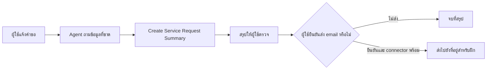

# แบบฝึกหัดที่ 3 สร้าง Agent Flow สำหรับสรุปคำขอบริการ

## Exercise Overview

เราจะสร้าง `Create Service Request Summary` เพื่อรับข้อมูลที่ Agent รวบรวมแล้วจัดเป็นสรุปมาตรฐาน เปรียบเหมือนแบบฟอร์มส่งต่อที่ช่วยให้ทุกคำขอมีหัวข้อเหมือนกัน โดยเจ้าหน้าที่ยังคงเป็นผู้ตรวจและตัดสินใจ

> **License:** ต้องมีสิทธิ์สร้าง Agent flow ใน Copilot Studio และมี Copilot Studio capacity ตามที่ Environment กำหนด ส่วนการส่ง email เป็น Optional Extension และต้องใช้ Office 365 Outlook connection ที่องค์กรอนุญาต

## Prerequisites

- ทำ [แบบฝึกหัดที่ 2](./exercise-02-add-knowledge) แล้ว
- เปิด Agent `ttb Service Request Assistant [ชื่อเล่น]`
- ใช้ข้อมูลจำลองเท่านั้น



## Scenario 1 สร้างสรุปที่พร้อมให้คนตรวจ

Agent ต้องรวบรวมประเภทคำขอ อาการหรือความต้องการ ผลกระทบ และระดับความเร่งด่วน แล้วเรียก Flow เพื่อจัดรูปแบบสรุป ห้ามอนุมัติหรือเปลี่ยนแปลงระบบ

### Practice 1 สร้าง Agent Flow แบบไม่ใช้ Connector

**Primary target:** สร้าง Flow แบบ real-time ที่รับข้อมูลคำขอและส่งสรุปมาตรฐานกลับไปยัง Agent

#### Steps

1. ใน Copilot Studio ไปที่ `Flows`
2. เลือก `New flow` > `Agent flow`
3. ตั้งชื่อ Flow ว่า

   ```text
   Create Service Request Summary
   ```

4. เปิด Trigger `When an agent calls the flow` และเพิ่ม input ชนิด Text สี่รายการ

   ```text
   RequestType
   IssueSummary
   BusinessImpact
   Priority
   ```

5. เพิ่ม action `Compose` ระหว่าง Trigger และ `Respond to the agent`
6. วางโครงข้อความต่อไปนี้ แล้วแทนที่ค่าระหว่างวงเล็บด้วย Dynamic content ของ input ที่ตรงกัน

   ```text
   Service Request Summary
   Request type: [RequestType]
   Issue summary: [IssueSummary]
   Business impact: [BusinessImpact]
   Priority: [Priority]
   Status: Waiting for human review
   ```

7. เปิด `Respond to the agent` และเพิ่ม output ชนิด Text ชื่อ

   ```text
   FormattedSummary
   ```

8. กำหนดค่า `FormattedSummary` เป็น Outputs จาก `Compose`
9. เปิด Settings ของ `Respond to the agent` และตรวจว่า `Asynchronous response` เป็น `Off`
10. เลือก `Publish` และรอให้ Flow พร้อมใช้งาน

> **⚠️ Note:** Agent Flow ที่ใช้เป็น Tool ต้องมี `When an agent calls the flow`, `Respond to the agent`, ตอบแบบ real-time และทำงานเสร็จภายในขีดจำกัดของระบบ

#### Checkpoint

- Flow ถูก Publish และส่ง `FormattedSummary` กลับได้โดยไม่ใช้ Connector ภายนอก

#### Expected Output

- Agent Flow `Create Service Request Summary` หนึ่งรายการ

### Practice 2 เพิ่ม Flow เป็น Tool ของ Agent

**Primary target:** เชื่อม Flow เป็น Agent-level Tool และทำให้ Agent เรียกใช้เมื่อผู้ใช้ขอสรุปคำขอบริการ

#### Steps

1. กลับไปที่ Agent แล้วเปิด `Tools`
2. เลือก `Add a tool` > `Flow`
3. เลือก `Create Service Request Summary` แล้วเลือก `Add and configure`
4. ตั้ง Description ของ Tool

   ```text
   Use this tool when the user asks to prepare a service request summary.
   Collect RequestType, IssueSummary, BusinessImpact, and Priority before calling it.
   Return the summary for human review. Never imply that the request is approved or completed.
   ```

5. ตรวจชื่อและ Description ของ input ทั้งสี่รายการให้ Agent เข้าใจข้อมูลที่ต้องส่ง
6. ตั้ง Completion ให้ Agent แสดง `FormattedSummary` แก่ผู้ใช้เพื่อ Review
7. เลือก `Save`
8. เพิ่มกฎต่อไปนี้ท้าย `Instructions` ของ Agent

   ```text
   - When the user asks to prepare a service request summary, collect RequestType,
     IssueSummary, BusinessImpact, and Priority, then use Create Service Request Summary.
   - Show the returned summary and remind the user that a human must review it.
   ```

9. เปิดแผงทดสอบและส่งข้อความ

   ```text
   ช่วยสรุปคำขอบริการให้หน่อย ระบบ Customer Demo Portal เปิดช้ามากตั้งแต่ 9 โมง
   และกระทบผู้ใช้สำหรับการฝึกประมาณ 12 คน
   ```

10. ตอบข้อมูลเพิ่มเติมเมื่อ Agent ถาม แล้วตรวจรูปแบบสรุปที่ได้รับ

#### Checkpoint

- Agent ถามข้อมูลที่ขาด เรียก Tool และแสดงสรุปที่ลงท้ายด้วย `Waiting for human review`

#### Expected Output

- Agent ที่เรียก Flow และคืนสรุปคำขอบริการได้ครบสี่หัวข้อ

## Optional Extension ส่งสรุปทาง Email

ทำส่วนนี้เมื่อผู้สอนยืนยันว่า Office 365 Outlook connector และนโยบาย Environment พร้อมเท่านั้น

1. เพิ่ม input ชนิด Email ชื่อ `RecipientEmail` ใน Trigger
2. เพิ่ม `Office 365 Outlook` action `Send an email (V2)` หลัง `Compose`
3. ใช้ `RecipientEmail` เป็น `To` และใช้ Subject ต่อไปนี้

   ```text
   Training service request summary for review
   ```

4. ใช้ Outputs จาก `Compose` เป็น Body ห้ามแนบไฟล์หรือข้อมูลจริง
5. เพิ่ม output `DeliveryMessage` ใน `Respond to the agent` เพื่อยืนยันว่า Flow ส่งไปยังที่อยู่ใด
6. ใน Tool configuration เปิดการยืนยันจากผู้ใช้ก่อนเรียก action ที่ส่ง email หากตัวเลือกนี้มีใน Environment
7. ทดสอบด้วย email ของผู้เรียนเองหรือที่อยู่สำหรับฝึกที่ผู้สอนอนุมัติเท่านั้น
8. หาก connector, consent หรือ Data policy บล็อก ให้บันทึกข้อความผิดพลาดและจบที่สรุปจาก Practice 2 ห้ามหลีกเลี่ยงนโยบาย

### Checkpoint สำหรับ Optional Extension

- Email ถูกส่งหลังผู้ใช้ยืนยันเท่านั้น หรือมีบันทึกชัดเจนว่า tenant บล็อกขั้นตอนใด

## Summary

เราแยกการคุยแบบยืดหยุ่นออกจากงานที่ต้องมีรูปแบบแน่นอน Agent เป็นผู้เก็บบริบท ส่วน Agent Flow จัดสรุปให้สม่ำเสมอและส่ง email เฉพาะเมื่อมีสิทธิ์และการยืนยัน

[แบบฝึกหัดก่อนหน้า](./exercise-02-add-knowledge) | [กลับหน้าหลัก](/) | [แบบฝึกหัดถัดไป ทดสอบและ Publish](./exercise-04-publish-and-review)
